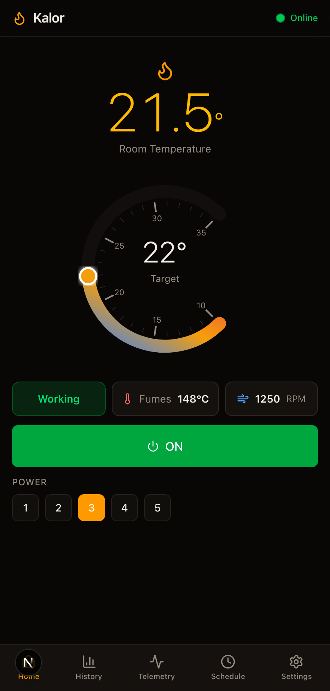
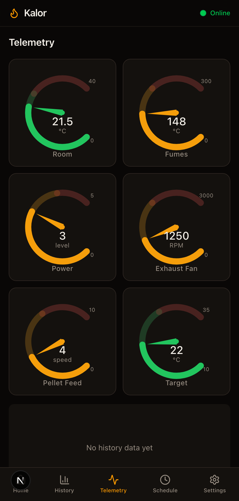
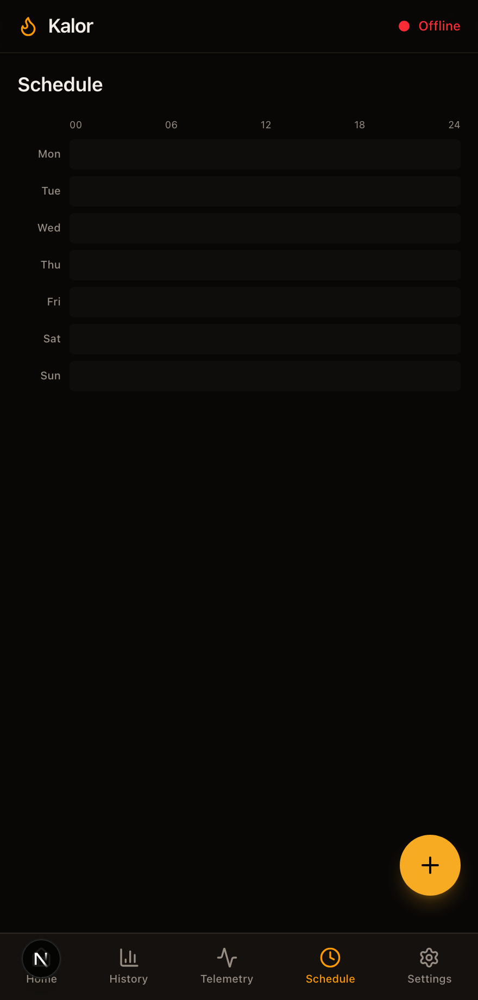
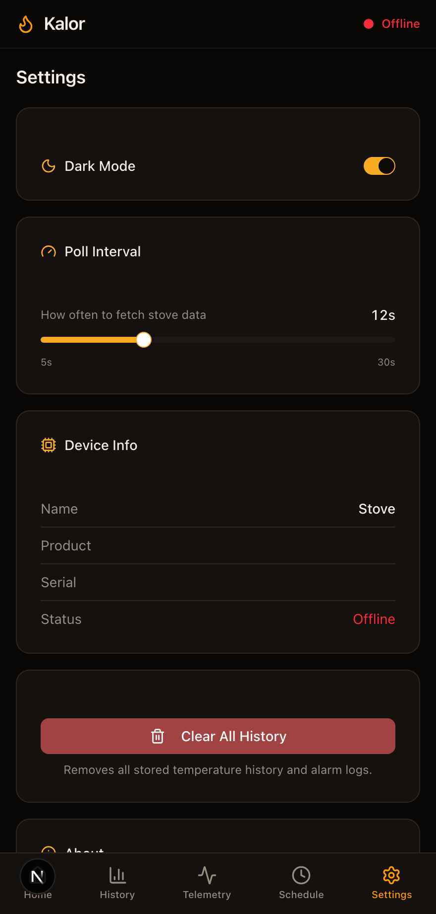

# Kalor

[](https://github.com/Awis13/kalor/actions/workflows/ci.yml)
[](LICENSE)

Control app and Home Assistant integration for **Kalor Petit** pellet stove via Duepi EVO protocol.

```
┌──────────┐      TCP/ASCII       ┌───────────────────┐       TCP       ┌────────────┐
│  Kalor   │ ◄──────────────────► │  duepiwebserver2  │ ◄─────────────► │  This app  │
│  Stove   │    Duepi EVO WiFi    │   .com:3000       │   Cloud relay   │            │
└──────────┘                      └───────────────────┘                 └────────────┘
```

## Screenshots

| Dashboard | Telemetry | Schedule | Settings |
|-----------|-----------|----------|----------|
|  |  |  |  |

_Captured with the built-in [demo mode](#demo-mode) — no live stove required._

## What this demonstrates

A full-stack hobby project built end-to-end from a bare protocol:

- **Protocol reverse-engineering.** The Duepi EVO WiFi module has no public API. The
  command set, ASCII framing, checksum, 32-bit status flags and handshake in
  `src/lib/duepi-client.ts` / `custom_components/kalor/duepi_client.py` were reverse-engineered
  by sniffing the vendor "DP Remote" app and cross-checking community notes.
- **Full-stack Next.js.** App Router with server-side API routes proxying a stateful TCP
  client (singleton socket, sequential command queue, auto-reconnect), a Zustand store with
  polling and optimistic UI, and a mobile-first PWA front end (Tailwind + shadcn/ui, Recharts
  telemetry, IndexedDB history, offline manifest).
- **Home Assistant integration.** A native custom component exposing the stove as **10 entities**
  (climate, sensors, binary_sensor, number, button) via a `DataUpdateCoordinator`, with a
  config flow and translations.

## Demo mode

The dashboard normally requires a live stove (`DUEPI_DEVICE_CODE`). Set
`NEXT_PUBLIC_KALOR_DEMO=1` to serve canned data from the status/command API routes so the UI
renders offline — handy for local development and the screenshots above:

```bash
NEXT_PUBLIC_KALOR_DEMO=1 npm run dev
```

## What's here

### `/src` — Web Dashboard (Next.js PWA)

Standalone web app for controlling the stove from any device. Real-time temperature monitoring, power control, scheduling, alarm history, and telemetry charts.

- **Stack:** Next.js 16, React 19, TypeScript, Tailwind CSS, shadcn/ui, Zustand, Recharts
- **Protocol client:** `src/lib/duepi-client.ts` — TCP over WebSocket, command queue, checksum, auto-reconnect

```bash
cp .env.example .env.local   # set DUEPI_DEVICE_CODE
npm install && npm run dev
```

### `/custom_components/kalor` — Home Assistant Integration

Custom integration that exposes the stove as a native HA device with 10 entities:

| Entity | Type | Description |
|--------|------|-------------|
| `climate.kalor_petit` | climate | On/off, target temperature 10-35 °C |
| `sensor.kalor_petit_room_temperature` | sensor | Room temperature (°C) |
| `sensor.kalor_petit_fumes_temperature` | sensor | Exhaust gas temperature (°C) |
| `sensor.kalor_petit_exhaust_fan_speed` | sensor | Exhaust fan (RPM) |
| `sensor.kalor_petit_power_level` | sensor | Current power level (0-6) |
| `sensor.kalor_petit_pellet_feed_speed` | sensor | Pellet feed speed |
| `sensor.kalor_petit_status` | sensor | Status text (Off / Ignition / Heating / ...) |
| `binary_sensor.kalor_petit_alarm` | binary_sensor | Alarm active + code + description |
| `number.kalor_petit_power_level` | number | Power level slider 0-6 (6 = auto) |
| `button.kalor_petit_reset_error` | button | Clear stove error |

#### Install on Home Assistant

```bash
# Copy to HA config
scp -P 22222 -r custom_components/kalor root@<HA_IP>:/config/custom_components/kalor/

# Restart HA, then add integration:
# Settings → Devices & Services → Add Integration → "Kalor"
# Enter your device code from the DP Remote app
```

## Docker

```bash
cp .env.example .env
# edit .env — set your DUEPI_DEVICE_CODE

docker compose up -d --build
# http://localhost:3100
```

Healthcheck is built-in — `docker ps` will show the status.

## Duepi EVO Protocol

Binary/ASCII over TCP. Each command:

```
ESC + "R" + <cmd> + <checksum 2 hex> + "&"
```

Response: 10 bytes ASCII. Checksum = `sum(ord("R") + ord(each char in cmd)) & 0xFF`.

Handshake: `master:<device_code>#` — device code from the DP Remote mobile app.

| Command | Read | Description |
|---------|------|-------------|
| `D9000` | 32-bit flags | Status (off / ignition / working / cooling / eco) |
| `D1000` | value/10 | Room temperature |
| `D0000` | value | Fumes temperature |
| `D3000` | 0-6 | Power level |
| `D4000` | value | Pellet feed speed |
| `EF000` | value×10 | Exhaust fan RPM |
| `DA000` | 0-14 | Error code |
| `C6000` | value | Target temperature setpoint |

| Command | Write | Description |
|---------|-------|-------------|
| `F0010` | — | Power on |
| `F0000` | — | Power off |
| `F00x0` | x=0-6 | Set power level (6=auto) |
| `F2xx0` | xx=hex | Set target temperature |
| `D6000` | — | Reset error |

## License

[MIT](LICENSE)
